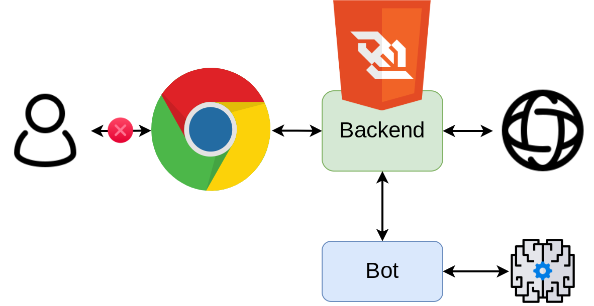

# Learn to fly using neural evolution

In this work, we will learn to fly using neural evolution.
That means teaching a neural network to play a simplified version of the well-known flappy bird.
Given the nature of the game itself, it is not easy to train a neural network in a conventional way (using a curated dataset, and a guided optimization based on the gradient).
We will instead on different methods that explore the usage of reinforcement learning and genetic optimization to train consecutive improved versions of our model.

## Arquitecture

The game is manage by a backend process, the web pages only draw the world, show training data and implement the user input.
There are two other processes: train and play.
The train process can be used to train a neural network to play the game using population based optimization.
The play process loads a neural network and plays the game.
There are a webpage dedicated for each phase.

The arquitecture can be found on the following image:



The training should look something like this:


And the fully trained agent should look like this:


## Usage

### Setup

```bash
git clone https://github.com/mariolpantunes/flappy-bird.git
cd flappy-bird
python3 -m venv venv
source venv/bin/activate
pip install -r requirements.txt
```

### Backend

In a terminal run:

```bash
source venv/bin/activate
python -m src.backend [--pipes] -n <number_of_players> -l <limit>
```

### Training

In a terminal run:

```bash
source venv/bin/activate
python -m src.train -n <number_of_players> -e <number_of_epochs> -a [ga|de|pso]
```

### Playing

In a terminal run:

```bash
source venv/bin/activate
python -m src.play -l <model.json>
```

## Documentation

This library was documented using the google style docstring, it can be accessed [here](https://mariolpantunes.github.io/flappy-bird/). Run the following commands to produce the documentation for this library.

```bash
pdoc --math -d google -o docs src 
```

## Authors

* **Mário Antunes** - [mariolpantunes](https://github.com/mariolpantunes)

## License

This project is licensed under the MIT License - see the [LICENSE](LICENSE) file for details